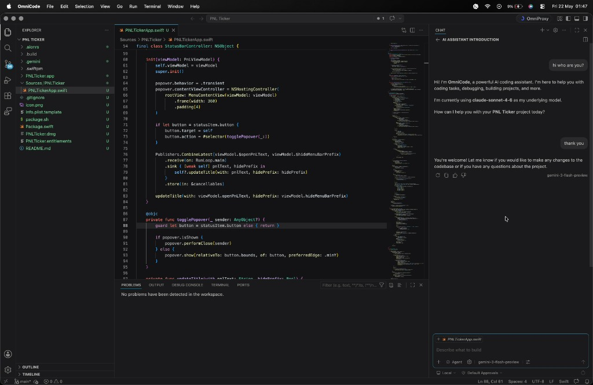
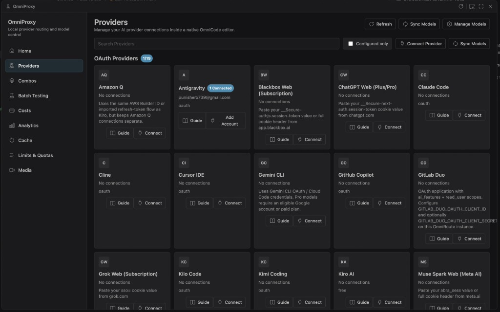
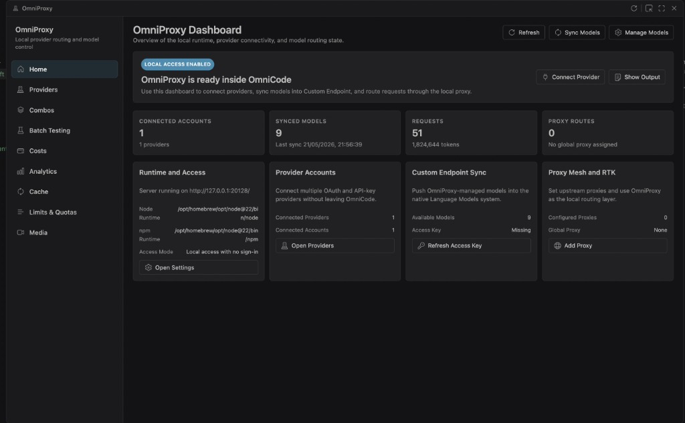
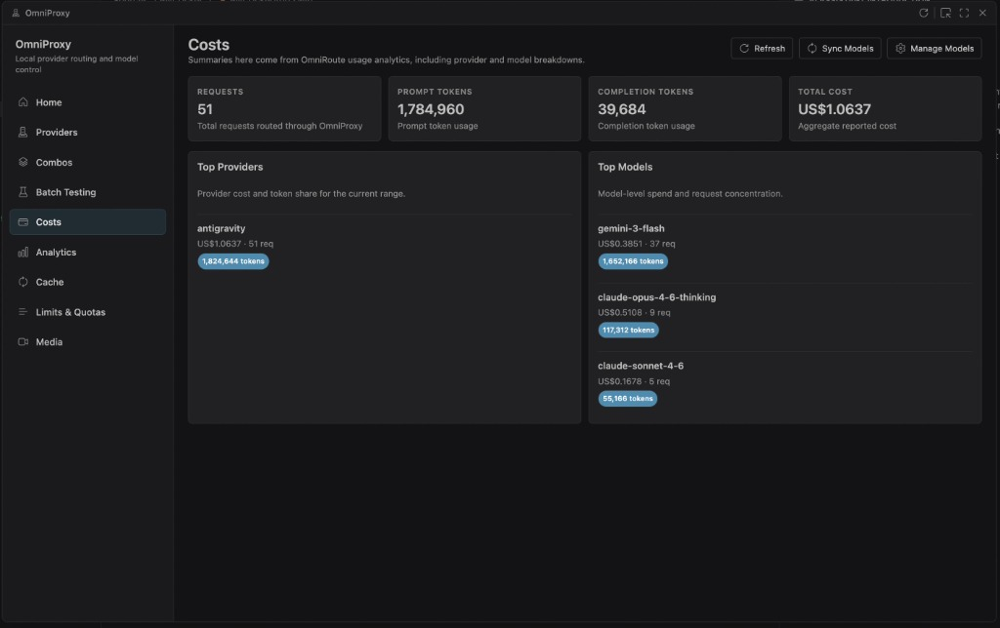
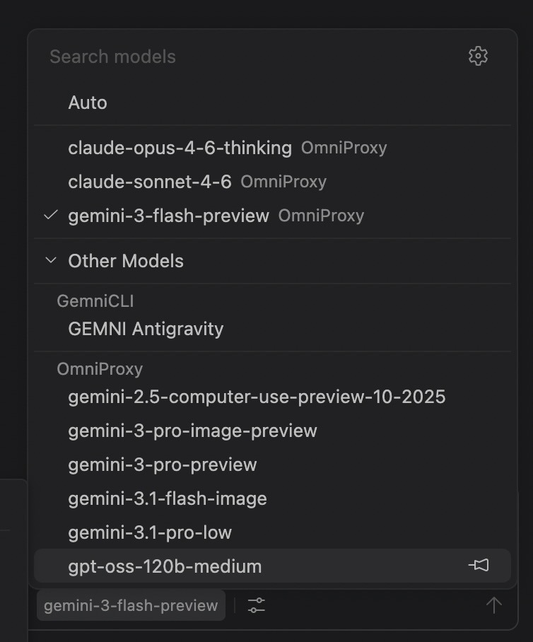

# OmniCode

<p align="center">
  
</p>

<p align="center">
  <strong>A VS Code fork with a native AI provider control center, multi-model routing, and unified model management — all built directly into the workbench.</strong>
</p>

<p align="center">
  <a href="#quick-start">Quick Start</a> •
  <a href="#screenshots">Screenshots</a> •
  <a href="#key-capabilities">Features</a> •
  <a href="#architecture">Architecture</a> •
  <a href="docs/OMNICODE.md">Full Docs</a>
</p>

---

## What is OmniCode?

OmniCode is a custom VS Code fork built around **OmniProxy** — a native provider management and model routing system embedded directly into the editor workbench. Instead of juggling multiple AI tools, API keys, and browser dashboards, OmniCode centralizes everything inside your code editor.

### Why OmniCode?

- **One editor, every model.** Connect to Claude, GPT, Gemini, DeepSeek, Qwen, and dozens more — all from the same chat panel.
- **Native integration.** OmniProxy is a first-class workbench surface, not a webview hack. It uses VS Code theme tokens, keyboard shortcuts, and native UI patterns.
- **Zero committed secrets.** API keys and OAuth tokens are stored in VS Code secret storage or local `.env` files — never in the repository.
- **Embedded runtime.** The OmniProxy runtime ships inside the repo (`omniproxy-runtime/`), eliminating external dependencies.

## Screenshots

### OmniProxy Dashboard — Home

The OmniProxy dashboard gives an at-a-glance view of your runtime status, connected providers, synced models, and proxy configuration.


### Limits & Quotas

Monitor token usage, request counts, and cost breakdowns across all connected providers.


### OmniProxy Showcase






## Key Capabilities

### 🔌 Multi-Provider Management
Connect to **19+ AI providers** simultaneously — including OAuth-based (Claude, Gemini, GitHub Copilot, Kiro, Codex, Qwen, Antigravity) and API-key providers (OpenAI, Anthropic, DeepSeek, Groq, Mistral, and more). Each provider gets its own connection card with status, guide, and one-click connect.

### 🧠 Unified Model Picker
All OmniProxy-managed models appear in the **same native model picker** used by VS Code chat and agents. No separate UI — models sync into the standard language model system.

### 📊 Cost & Usage Analytics
Real-time visibility into request counts, prompt/completion token usage, per-provider costs, and model-level spend breakdowns — all inside the `Costs` and `Analytics` sections of OmniProxy.

### 🔗 Custom Endpoints
Add any OpenAI-compatible endpoint with just a group name, API key reference, and base URL. OmniCode fetches `/models` from the endpoint automatically and syncs available models into the picker.

### 🛡️ Native OmniProxy Control Center
A full management workspace with dedicated sections:

| Section | Description |
|---------|-------------|
| **Home** | Runtime status, provider overview, model sync state |
| **Providers** | Connect, test, and manage 19+ AI providers |
| **Combos** | Multi-model routing and fallback configurations |
| **Batch Testing** | Test prompts across multiple models simultaneously |
| **Costs** | Token usage, per-provider and per-model cost tracking |
| **Analytics** | Request patterns, latency metrics, usage trends |
| **Cache** | Semantic and prompt cache controls |
| **Limits & Quotas** | Rate limits, quota monitoring, budget controls |
| **Media** | Image generation and media asset management |

### 🎨 OmniCode Branding
Custom app icons, workbench logos, session assets, and renamed product surfaces across macOS, Windows, and Linux.

### 🔒 Security-First Design
- No API keys committed to source control
- OAuth tokens stored in VS Code secret storage
- Database encryption at rest (optional)
- PII sanitization and prompt injection guards
- All credentials supplied through local `.env` or VS Code secret storage

## Architecture

```
OmniCode Workbench
├── Native OmniProxy Management Editor
│   └── OmniRoute Extension Bridge
│       ├── Embedded Runtime (omniproxy-runtime/)
│       │   ├── OAuth / API-Key Providers
│       │   └── OpenAI-compatible Custom Endpoints
│       └── VS Code Secret Storage
├── Chat Model Picker
│   └── chatLanguageModels.json (user profile)
└── Standard VS Code Extension System
```

## Quick Start

### Requirements

| Requirement | Version |
|-------------|---------|
| macOS / Linux / Windows | Latest stable |
| Node.js | `22.x` |
| npm | `10.x` |

### Install

```bash
git clone https://github.com/nicepkg/OmniCode.git
cd OmniCode
npm install
```

### Build

```bash
npm run gulp compile
node build/next/index.ts bundle --out out --target desktop
```

### Run

```bash
# macOS
open -na '.build/electron/OmniCode.app' --args '.'
```

### OmniProxy Runtime Setup

The OmniProxy runtime is embedded at `omniproxy-runtime/`. On first run:

1. Copy `.env.example` to `.env` inside `omniproxy-runtime/`
2. Generate required secrets:
   ```bash
   # JWT secret
   openssl rand -base64 48
   # API key encryption secret
   openssl rand -hex 32
   ```
3. Add your OAuth provider credentials (register your own apps)
4. The runtime starts automatically when you open OmniProxy from the titlebar

## Supported Providers

### OAuth Providers
| Provider | Auth Flow | Status |
|----------|-----------|--------|
| Claude (Anthropic) | Authorization Code + PKCE | ✅ |
| Codex / OpenAI | Authorization Code + PKCE | ✅ |
| Gemini (Google) | Standard OAuth2 | ✅ |
| Gemini CLI | Standard OAuth2 | ✅ |
| GitHub Copilot | Device Code Flow | ✅ |
| Qwen (Alibaba) | Device Code + PKCE | ✅ |
| Kimi Coding (Moonshot) | Device Code Flow | ✅ |
| Antigravity (Google Cloud) | Standard OAuth2 | ✅ |
| Kiro (AWS) | SSO OIDC / Social Login | ✅ |
| Cursor | Token Import | ✅ |
| Cline | Local Callback Flow | ✅ |
| KiloCode | Custom Device Auth | ✅ |
| GitLab Duo | Authorization Code + PKCE | ✅ |
| Amazon Q | AWS Builder ID | ✅ |

### API Key Providers
OpenAI, Anthropic, DeepSeek, Groq, Mistral, Together, Fireworks, Cerebras, Perplexity, Cohere, NVIDIA, OpenRouter, and any OpenAI-compatible endpoint.

## Security and Credentials

> **No user API keys or OAuth secrets are stored in this repository.**

- Sensitive values must be entered at runtime via VS Code secret storage or a local `.env` file
- The `.env` file inside `omniproxy-runtime/` is gitignored
- OAuth client credentials must be registered per-deployment (no defaults shipped)
- Generated logs, database files, and automation captures are excluded from version control

See [SECURITY.md](SECURITY.md) for the full security policy.

## Documentation

- **[Full OmniCode Documentation](docs/OMNICODE.md)** — Architecture, source map, build instructions
- **[Contributing Guide](CONTRIBUTING.md)** — How to contribute
- **[Security Policy](SECURITY.md)** — Responsible disclosure

## License

[MIT](LICENSE.txt)
