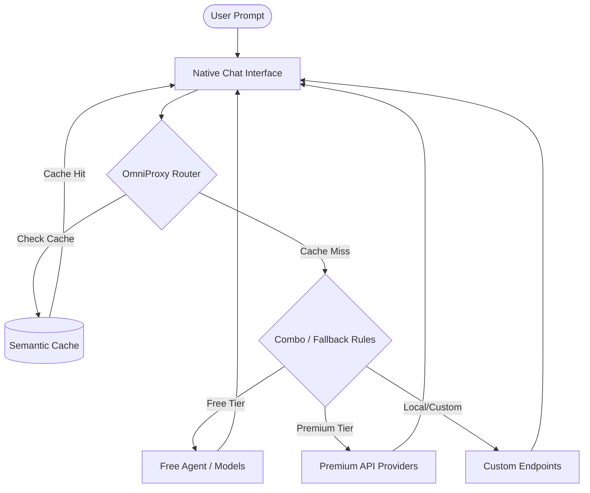
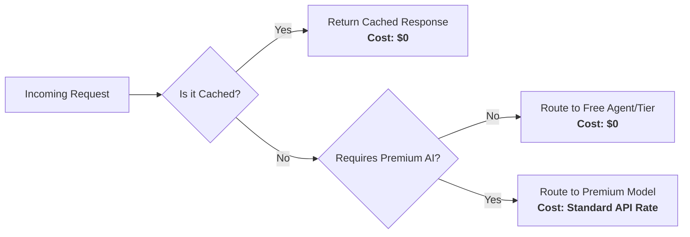

# OmniCode

<p align="center">
  
</p>

<p align="center">
  <strong>An advanced, AI-native IDE with a built-in provider control center, multi-model routing, and unified model management.</strong>
</p>

<p align="center">
  <a href="#quick-start">Quick Start</a> •
  <a href="#screenshots">Screenshots</a> •
  <a href="#key-capabilities">Features</a> •
  <a href="#how-it-works">How it Works</a> •
  <a href="docs/OMNICODE.md">Full Docs</a>
</p>

---

## What is OmniCode?

OmniCode is an intelligent development environment designed to centralize and streamline AI interactions. Instead of juggling multiple AI tools, API keys, and browser dashboards, OmniCode brings everything directly into your editor through its native **OmniProxy** system.

With OmniCode, you can seamlessly connect to dozens of AI models, monitor usage, manage API costs, and execute advanced multi-model routing—all within a secure, high-performance workspace.

## Key Capabilities

### 🔌 Multi-Provider Management
Connect to **19+ AI providers** simultaneously. OmniCode supports OAuth-based providers (Claude, Gemini, GitHub Copilot, Kiro, Codex, Qwen, Antigravity) and API-key providers (OpenAI, Anthropic, DeepSeek, Groq, Mistral). Each provider features a dedicated connection card with live status, setup guides, and one-click connectivity.

### 🧠 Unified Model Picker
All managed models are automatically synced into the standard language model picker. There is no separate UI or fragmented experience—models from any connected provider are available instantly in the editor's native chat and AI agent interfaces.

### 🤖 Personalized Coding Agent
Tailor your AI assistant to your exact workflow. By defining custom routing rules, context parameters, and system prompts in OmniProxy, your coding agent becomes deeply personalized. It adapts to your coding style while allowing you to effortlessly swap the underlying model brain—from local open-source models to state-of-the-art paid models—without changing your editing habits.

### 📊 Cost & Usage Analytics
Gain real-time visibility into your AI usage. Monitor request counts, prompt/completion token usage, per-provider costs, and model-level spend breakdowns directly from the **Costs** and **Analytics** dashboards.

### 🔗 Custom Endpoints
Integrate any OpenAI-compatible endpoint by simply providing a group name, API key, and base URL. OmniCode automatically fetches available models from the endpoint and syncs them into your workspace.

### 🛡️ Native OmniProxy Control Center
A comprehensive, built-in management workspace featuring:

| Section | Description |
|---------|-------------|
| **Home** | Global runtime status, provider overview, and model sync state. |
| **Providers** | Connect, test, and manage integrations for 19+ AI providers. |
| **Combos** | Configure multi-model routing and automated fallback strategies. |
| **Batch Testing** | Evaluate and test prompts across multiple models simultaneously. |
| **Costs** | Detailed tracking of token usage and financial spend. |
| **Analytics** | Deep dive into request patterns, latency metrics, and usage trends. |
| **Cache** | Advanced semantic and prompt cache controls for optimized performance. |
| **Limits & Quotas** | Set rate limits, monitor quotas, and enforce budget controls. |
| **Media** | Manage image generation and rich media assets. |

## How It Works

OmniCode's architecture is designed for speed, security, and seamless integration:



1. **User Request:** You interact with the native Chat or AI agent interface in the editor.
2. **Model Routing:** The request is routed through the embedded **OmniProxy Runtime**, which evaluates your current configuration, fallbacks, and routing rules (Combos).
3. **Provider Execution:** OmniProxy securely authenticates the request using locally stored credentials (never committed to code) and dispatches it to the selected AI provider (e.g., OpenAI, Anthropic, or a custom endpoint).
4. **Response & Caching:** The response is streamed back to the editor in real-time, with optional semantic caching applied to reduce costs and latency on future identical requests.

## Cost Savings & Free Coding Agent

OmniCode is built to dramatically reduce API spend through intelligent request handling:



- **Semantic Caching:** Duplicate or semantically identical prompts are served instantly from the local cache without hitting paid APIs, saving both time and money.
- **Free Coding Agent:** For standard coding queries, OmniProxy routes your request to capable free-tier models or local custom endpoints. This means your day-to-day coding agent can operate completely for free.
- **Strategic Fallbacks:** Premium models are preserved for complex reasoning tasks, while routine completions are handled by cost-effective or free providers.

## Screenshots

### OmniProxy Dashboard — Home
The dashboard provides an at-a-glance view of your runtime status, connected providers, synced models, and proxy configuration.


### Limits & Quotas
Monitor token usage, request counts, and cost breakdowns across all connected providers.

### OmniProxy Showcase


## Quick Start

### Requirements

| Requirement | Version |
|-------------|---------|
| macOS / Linux / Windows | Latest stable |
| Node.js | `22.x` |
| npm | `10.x` |

### Install

```bash
git clone https://github.com/nicepkg/OmniCode.git
cd OmniCode
npm install
```

### Build

```bash
npm run gulp compile
node build/next/index.ts bundle --out out --target desktop
```

### Run

```bash
# macOS
open -na '.build/electron/OmniCode.app' --args '.'
```

### Setup OmniProxy Runtime

The OmniProxy runtime handles all AI requests locally and securely. On first run:

1. Copy `.env.example` to `.env` inside the `omniproxy-runtime/` directory.
2. Generate the necessary security secrets:
   ```bash
   # JWT secret
   openssl rand -base64 48
   # API key encryption secret
   openssl rand -hex 32
   ```
3. Enter your provider API keys or OAuth credentials in the `.env` file.
4. The runtime will automatically initialize when you open the OmniProxy dashboard in the editor.

## Supported Providers

### OAuth Providers
| Provider | Auth Flow | Status |
|----------|-----------|--------|
| Claude (Anthropic) | Authorization Code + PKCE | ✅ |
| Codex / OpenAI | Authorization Code + PKCE | ✅ |
| Gemini (Google) | Standard OAuth2 | ✅ |
| Gemini CLI | Standard OAuth2 | ✅ |
| GitHub Copilot | Device Code Flow | ✅ |
| Qwen (Alibaba) | Device Code + PKCE | ✅ |
| Kimi Coding (Moonshot) | Device Code Flow | ✅ |
| Antigravity (Google Cloud) | Standard OAuth2 | ✅ |
| Kiro (AWS) | SSO OIDC / Social Login | ✅ |
| Cursor | Token Import | ✅ |
| Cline | Local Callback Flow | ✅ |
| KiloCode | Custom Device Auth | ✅ |
| GitLab Duo | Authorization Code + PKCE | ✅ |
| Amazon Q | AWS Builder ID | ✅ |

### API Key Providers
OpenAI, Anthropic, DeepSeek, Groq, Mistral, Together, Fireworks, Cerebras, Perplexity, Cohere, NVIDIA, OpenRouter, and any OpenAI-compatible endpoint.

## Security

**OmniCode is designed with a security-first architecture. No user API keys or OAuth secrets are stored in this repository.**

- Sensitive values are managed at runtime via secure secret storage or a local `.env` file.
- The `.env` file and generated artifacts (logs, databases) are strictly ignored by version control.
- PII sanitization and prompt injection guards are built into the proxy layer.
- Database encryption at rest is supported.

See [SECURITY.md](SECURITY.md) for the full security policy.

## Documentation

- **[Full OmniCode Documentation](docs/OMNICODE.md)** — Architecture, detailed flows, and build instructions.
- **[Contributing Guide](CONTRIBUTING.md)** — How to contribute.
- **[Security Policy](SECURITY.md)** — Responsible disclosure.

## License

[MIT](LICENSE.txt)
