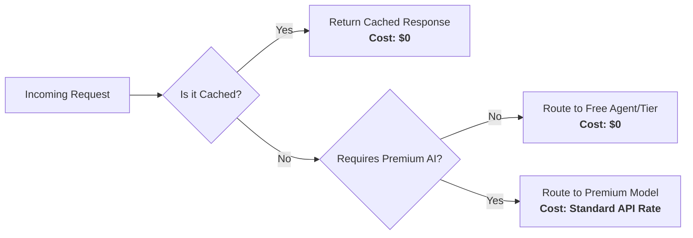

<!-- Add your promotional banner as docs/media/omnicode-banner.png -->
<!-- Banner: AI Coding, Built for Developers — github.com/cyborgateuk-arch/OmniCode -->
<p align="center">
  
</p>

<h1 align="center">OmniCode</h1>

<p align="center">
  <strong>The AI-Native IDE with a Built-In Provider Control Center.<br/>Connect 169+ AI providers. Route across free & paid models. Zero config.</strong>
</p>

<p align="center">
  <a href="https://github.com/cyborgateuk-arch/OmniCode"></a>
  <a href="https://github.com/cyborgateuk-arch/OmniCode/releases"></a>
  <a href="https://github.com/cyborgateuk-arch/OmniCode/stargazers"></a>
  <a href="https://github.com/cyborgateuk-arch/OmniCode/issues"></a>
  <a href="https://github.com/cyborgateuk-arch/OmniCode/pulls"></a>
  
  
  
  
</p>

<p align="center">
  🚀 <a href="#-quick-start">Quick Start</a> •
  🔌 <a href="#-19-ai-providers--unified-model-picker">Providers</a> •
  🎯 <a href="#-combos--multi-model-routing">Combos</a> •
  📊 <a href="#-cost-savings--free-coding-agent">Cost Savings</a> •
  🛡️ <a href="#-omniproxy-native-control-center">OmniProxy</a> •
  📸 <a href="#-screenshots--showcase">Screenshots</a> •
  📖 <a href="#-documentation">Docs</a>
</p>

<p align="center">
  💥 <a href="#-the-promise">The Promise</a> •
  🤔 <a href="#-why-omnicode">Why</a> •
  🏆 <a href="#-what-sets-omnicode-apart">What Sets Apart</a> •
  🔒 <a href="#-private--secure-by-design">Security</a> •
  🏗️ <a href="#-architecture--how-it-works">Architecture</a> •
  🤝 <a href="#-contributing">Contributing</a>
</p>

---

## 💥 The Promise

**One IDE. 169+ providers. Every AI model you need — and a free coding agent that never stops.**

OmniCode is an intelligent development environment that **centralizes and streamlines every AI interaction** directly inside your editor. Stop juggling browser dashboards, dead API keys, and surprise bills. OmniCode brings it all home.

| | | |
|:---:|:---:|:---:|
| 🚫 **Never hit limits** | 💸 **$0 to start** | 📊 **Full cost visibility** |
| Auto-fallback across providers. Quota out? Next model takes over — zero downtime. | Free-tier OAuth providers (Kiro, Qoder, GitHub Copilot, Gemini CLI). No card needed. | Real-time dashboards for token usage, per-provider costs, and model-level spend. |
| 🔌 **Every model works** | 🧩 **One unified picker** | 🛡️ **Production-grade** |
| 169+ providers — Claude, GPT, Gemini, DeepSeek, Grok, Qwen — through one interface. | All models synced into the native editor picker. No separate UI or fragmented experience. | Semantic caching, combo routing, budget controls, PII guards, encryption at rest. |

---

## 🤔 Why OmniCode?

Stop juggling 10 dashboards, dead API keys, and surprise bills.

| ❌ The daily pain | ✅ How OmniCode fixes it |
|---|---|
| 📉 Subscription quota expires unused every month | **Maximize subscriptions** — track quota, use every token before reset |
| 🛑 Rate limits stop you mid-coding | **Auto-fallback combos** — route to the next provider in milliseconds |
| 💸 Expensive APIs ($20–50/mo per provider) | **Free coding agent** — route routine tasks to free-tier models at $0 |
| 🧰 Each AI tool wants its own setup | **One IDE, one picker** — every model in one unified dropdown |
| 🔐 API keys scattered across .env files | **Encrypted secret storage** — AES-256-GCM at rest, never in source control |
| 📊 No visibility into what you're spending | **Cost & analytics dashboards** — per-request, per-model, per-provider breakdowns |

```
┌──────────────────────────────────────────────────────────┐
│       OmniCode IDE  (Native Chat & AI Agent Interface)     │
└─────────────────────────┬──────────────────────────────────┘
                          │ Embedded OmniProxy Runtime
                          ▼
┌──────────────────────────────────────────────────────────┐
│              OmniProxy — Smart Router & Cache               │
│  Semantic caching · Combo routing · Budget controls         │
│  PII guards · Encrypted secrets · Cost analytics            │
└─────────────────────────┬──────────────────────────────────┘
        ┌─────────────┬────┴────────┬─────────────┐
        ▼ Tier 1      ▼ Tier 2      ▼ Tier 3       ▼ Tier 4
   SUBSCRIPTION     API KEY        FREE TIER      CUSTOM
   Claude Code,     OpenAI,        Kiro, Qoder,   Local LLMs,
   Codex, Copilot   DeepSeek       Gemini CLI     Ollama
   quota out? ───▶  budget hit? ─▶ always on ──▶  your server
```

---

## 🎯 Combos — Multi-Model Routing

A **Combo** is a chain of models OmniCode routes across automatically. Quota runs out, a provider fails, or costs spike — the combo silently slides to the next model. This is what makes OmniCode **unbreakable**. 🛡️

### ⚡ How it works

Configure fallback chains in the OmniProxy dashboard. OmniCode evaluates your rules in real-time:

```
Combo: "always-on-coding"                    Strategy: priority
  1. cc/claude-opus-4-7      ← OAuth subscription (use it fully)
  2. cx/gpt-5.5              ← Codex OAuth (second subscription)
  3. kr/claude-sonnet-4.6    ← Kiro FREE (unlimited Claude)
  4. qoder/deepseek-v3.2     ← Qoder FREE (always available)
Result: 4 layers of fallback = zero downtime
```

### 🔀 Routing strategies

| Goal | Strategy |
|------|----------|
| 🥇 Drain my subscription before paying | **Priority / Fill-first** |
| ⚖️ Spread load across accounts | **Round-robin** |
| 💸 Always cheapest viable model | **Cost-optimized** |
| 🧠 Best model for complex reasoning | **Premium escalation** |
| 🆓 Free-first for routine tasks | **Free agent routing** |

### 🧱 Resilience is built in

| Layer | Scope | What it does |
|-------|-------|-------------|
| 🔌 Circuit breaker | Whole provider | Stops hammering a failing provider; auto-probes to recover |
| 💤 Connection cooldown | One account/key | Skips a rate-limited key while others keep serving |
| 💾 Semantic cache | Identical prompts | Returns cached response instantly — cost: $0, latency: ~0ms |

---

## 🏆 What Sets OmniCode Apart

| Feature | OmniCode | Traditional IDEs | Other AI Tools |
|---------|----------|-------------------|----------------|
| 🔌 Built-in AI providers | **169+ (OAuth + API key)** | 1–2 | External only |
| 🆓 Free-tier routing | ✅ Automatic | ❌ | ❌ |
| 🔀 Multi-model combos | ✅ Configurable chains | ❌ | Rare |
| 📊 Cost & usage dashboards | ✅ Native | ❌ | Separate tool |
| 💾 Semantic caching | ✅ Built-in | ❌ | Rare |
| 🧩 Unified model picker | ✅ All models, one dropdown | 1 provider | N/A |
| 🔗 Custom endpoints | ✅ Any OpenAI-compatible | ❌ | Limited |
| 🛡️ PII & injection guards | ✅ Built-in | ❌ | Rare |
| 🔐 Encrypted secret storage | ✅ AES-256-GCM | Plaintext .env | Varies |
| 🖥️ Full IDE experience | ✅ VS Code-based editor | ✅ | ❌ CLI only |
| 📦 Batch testing | ✅ Cross-model evaluation | ❌ | ❌ |
| 🎨 Image generation | ✅ Built-in media tools | ❌ | Separate |

---

## 🔌 169+ AI Providers — Unified Model Picker

The most comprehensive provider ecosystem of any AI-native IDE. Connect via **OAuth** (one-click) or **API key** — all models appear instantly in the native editor picker.

### 🔐 OAuth Providers (One-Click Connect)

| Provider | Auth Flow | Models | Status |
|----------|-----------|--------|--------|
| **Claude** (Anthropic) | Authorization Code + PKCE | Opus 4.7, Sonnet 4.6, Haiku 4.5 | ✅ |
| **Codex** (OpenAI) | Authorization Code + PKCE | GPT-5.5, GPT-5.4, GPT-5.3 Codex | ✅ |
| **Gemini** (Google) | Standard OAuth2 | Synced via API (all models) | ✅ |
| **Gemini CLI** | Standard OAuth2 | Gemini 3.1 Pro, 3 Flash, 3.1 Flash Lite | ✅ |
| **GitHub Copilot** | Device Code Flow | GPT-5.5, Claude Opus 4.7, Gemini 3.1 Pro | ✅ |
| **Qwen** (Alibaba) | Device Code + PKCE | Qwen3 Coder Plus/Flash, Vision | ✅ |
| **Kimi Coding** (Moonshot) | Device Code Flow | Kimi K2.6, K2.6 Thinking | ✅ |
| **Antigravity** (Google Cloud) | Standard OAuth2 | Passthrough models | ✅ |
| **Kiro** (AWS) | SSO OIDC / Social Login | Claude Opus 4.7, Sonnet 4.6, Haiku 4.5 | ✅ |
| **Cursor** | Token Import | 70+ models (GPT, Claude, Gemini, Grok) | ✅ |
| **Cline** | Local Callback Flow | Claude, GPT, Gemini, DeepSeek, Kimi | ✅ |
| **KiloCode** | Custom Device Auth | OpenRouter models, GPT, Claude, Gemini | ✅ |
| **GitLab Duo** | Authorization Code + PKCE | Enterprise models | ✅ |
| **Amazon Q** | AWS Builder ID | AWS models | ✅ |
| **Qoder AI** | API Key / OAuth | Qwen3, Kimi K2, DeepSeek, ROME | ✅ |

### 🔑 API Key Providers

| Provider | Highlights |
|----------|------------|
| **OpenAI** | GPT-5.5, GPT-5.4, GPT-5.4 Mini/Nano, O3 |
| **Anthropic** | Claude Opus 4.7, Sonnet 4.6, Haiku 4.5 |
| **DeepSeek** | V4 Pro, V4 Flash |
| **Groq** | Llama 3.3 70B, Llama 4 Maverick, Qwen3 32B |
| **xAI** | Grok 4.3, Grok 4.20 (Reasoning, Multi Agent) |
| **Mistral** | Large 3, Medium 3.5, Small 4, Devstral 2 |
| **Together** | Llama 3.3 70B 🆓, DeepSeek R1 🆓, Qwen3 235B |
| **Fireworks** | Kimi K2.6, MiniMax M2.7, Qwen3.6 Plus |
| **Cerebras** | GLM 4.7, GPT OSS 120B |
| **Perplexity** | Sonar Deep Research, Reasoning Pro, Pro |
| **Cohere** | Command A Reasoning, Vision |
| **NVIDIA NIM** | GLM 5.1, Gemma 4, Nemotron 3 Super, DeepSeek V4 |
| **SiliconFlow** | DeepSeek V3.2, Qwen3 Coder 480B |
| **OpenRouter** | Auto (Best Available) — access to 200+ models |
| **HuggingFace** | Open-source model catalog |
| **Ollama Cloud** | DeepSeek V4, Kimi K2.6, GLM 5.1 |
| **MiniMax** | M2.7, M2.5, Highspeed variants |
| **GLM / ZAI** | GLM 5.1, GLM 5, GLM 5 Turbo |

### 🆓 Free Providers — $0, No Card

| Provider | What's Free | Limits |
|----------|-------------|--------|
| **Kiro AI** | Claude Opus 4.7, Sonnet 4.6, Haiku 4.5 | OAuth, generous limits |
| **Qoder AI** | Qwen3, DeepSeek, Kimi K2 | Unlimited for supported models |
| **Gemini CLI** | Gemini 3.1 Pro, 3 Flash | 180K requests/mo free |
| **GitHub Copilot** | GPT-5 Mini, Claude Haiku 4.5 | Free tier available |
| **Together AI** | Llama 3.3 70B, DeepSeek R1 Distill, Llama Vision | Free tier models |
| **NVIDIA NIM** | 13+ models | ~40 RPM free |
| **Cerebras** | GLM 4.7, GPT OSS 120B | Free tier with limits |
| **OpenCode** | GLM 5.1, Kimi K2.6, DeepSeek V4, MiMo V2.5 | Free tier available |

### 🔗 Custom Endpoints

Integrate **any OpenAI-compatible endpoint** in 3 steps:
1. Provide a **group name**
2. Supply the **API key**
3. Enter the **Base URL**

OmniCode automatically queries the `/models` endpoint and populates available models into the unified picker.

---

## 📊 Cost Savings & Free Coding Agent

OmniCode is built to **dramatically reduce API spend** through intelligent request handling:



### How it saves you money

| Strategy | Savings | How it works |
|----------|---------|-------------|
| 💾 **Semantic Caching** | **100%** on cache hits | Duplicate or semantically identical prompts served instantly from local cache |
| 🆓 **Free Agent Routing** | **100%** on routine tasks | Standard coding queries routed to free-tier models or local endpoints |
| 🎯 **Strategic Fallbacks** | **50–90%** | Premium models reserved for complex reasoning; routine tasks use cheap providers |
| 📉 **Quota Maximization** | **Subscription ROI ↑** | Drain your paid subscriptions fully before falling back to API-key providers |

### 💰 Real-world cost comparison

| Scenario | Without OmniCode | With OmniCode | Savings |
|----------|-----------------|--------------|---------|
| 100 routine code completions/day | ~$2.50/day (paid API) | $0 (free agent) | **$75/mo** |
| 50 repeated similar queries | ~$1.25/day (paid API) | $0 (semantic cache) | **$37/mo** |
| Subscription quota overflow | New API charges | Auto-fallback to free | **Variable** |

---

## 🛡️ OmniProxy Native Control Center

A comprehensive, **built-in management workspace** embedded directly in the editor. No browser dashboards, no external tools — everything is native.

| Section | Description |
|---------|-------------|
| 🏠 **Home** | Global runtime status, provider overview, model sync state, and proxy health |
| 🔌 **Providers** | Connect, test, and manage integrations for 169+ AI providers with live status cards |
| 🎯 **Combos** | Configure multi-model routing chains and automated fallback strategies |
| 🧪 **Batch Testing** | Evaluate and test prompts across multiple models simultaneously |
| 💰 **Costs** | Detailed tracking of token usage and financial spend per provider and model |
| 📊 **Analytics** | Deep dive into request patterns, latency metrics, and usage trends |
| 💾 **Cache** | Advanced semantic and prompt cache controls for optimized performance |
| 📏 **Limits & Quotas** | Set rate limits, monitor quotas, and enforce budget controls |
| 🖼️ **Media** | Manage image generation and rich media assets |

---

## 🏗️ Architecture & How It Works

OmniCode's architecture is designed for speed, security, and seamless integration:


### Request flow

1. **User Interaction:** You submit a prompt via the native Chat interface or AI agent in the editor.
2. **Model Selection:** The editor retrieves available models from `chatLanguageModels.json`, continuously synced by the OmniProxy extension.
3. **Smart Routing:** The request passes through the **OmniRoute Extension Bridge**, which evaluates active routing rules, combos, and fallbacks.
4. **Provider Execution:** The **Embedded Runtime** securely authenticates using locally stored credentials (never committed to code) and dispatches to the appropriate provider.
5. **Response & Caching:** The response streams back in real-time, with optional semantic caching applied to reduce costs and latency on future requests.

### Source map

| Area | Path | Description |
|------|------|-------------|
| 📦 Product metadata | `product.json` | Application identifiers, naming, and configuration |
| 🎨 Resources | `resources/` | Icon assets for macOS, Windows, Linux, and web |
| 🛡️ OmniProxy Dashboard | `src/vs/workbench/contrib/chat/browser/omniProxyManagement/` | Native management dashboard source code |
| ⚙️ OmniProxy Runtime | `omniproxy-runtime/` | Embedded Node.js backend for AI routing |
| 🔗 Provider Registry | `omniproxy-runtime/open-sse/config/providerRegistry.ts` | Single source of truth for all 169+ providers |
| 🧩 Extension Bridge | `extensions/omniroute/` | Connects workbench UI to OmniProxy runtime |
| 🧠 Model Discovery | `src/vs/workbench/contrib/chat/common/languageModels.ts` | Core logic for model discovery and endpoint integration |

---

## 🤖 Personalized Coding Agent

Tailor your AI assistant to your exact workflow. Through **Combos** configuration in OmniProxy, you define:

- 🎯 **Custom system prompts** — personalize the AI's behavior and tone
- 🧠 **Specialized context boundaries** — scope the AI to your project's architecture
- 🔀 **Preferred model fallbacks** — set your ideal model chain
- 🔄 **Hot-swap the brain** — switch from local open-source to state-of-the-art paid models without changing your editing habits

The result: a deeply personalized coding agent that adapts to your coding style, no matter which backend AI provider is currently active.

---

## 📸 Screenshots & Showcase

### OmniProxy Dashboard — Home
The dashboard provides an at-a-glance view of your runtime status, connected providers, synced models, and proxy configuration.


### OmniProxy Showcase


---

## 🚀 Quick Start

### Requirements

| Requirement | Version |
|-------------|---------|
| 🖥️ macOS / Linux / Windows | Latest stable |
| 📦 Node.js | `22.x` LTS (recommended) |
| 📦 npm | `10.x` |

### 1) Clone & install

```bash
git clone https://github.com/cyborgateuk-arch/OmniCode.git
cd OmniCode
npm install
```

### 2) Build

```bash
npm run gulp compile
node build/next/index.ts bundle --out out --target desktop
```

### 3) Run

```bash
# macOS
open -na '.build/electron/OmniCode.app' --args '.'

# Linux
.build/electron/OmniCode --no-sandbox .

# Windows
.build\electron\OmniCode.exe .
```

### 4) Setup OmniProxy Runtime

The OmniProxy runtime handles all AI requests locally and securely. On first run:

```bash
# Navigate to the runtime directory
cd omniproxy-runtime

# Copy the example environment file
cp .env.example .env

# Generate security secrets
openssl rand -base64 48    # JWT secret
openssl rand -hex 32       # API key encryption secret
```

Enter your provider API keys or OAuth credentials in the `.env` file. The runtime automatically initializes when you open the OmniProxy dashboard in the editor.

### 5) Connect a FREE provider (no signup)

Open the **OmniProxy Dashboard** → **Providers** → Connect **Kiro AI** (free Claude) or **Qoder AI** (free Qwen/DeepSeek) → done.

### 6) Start coding! 🎉

All connected models appear instantly in the native model picker. Select a model and start chatting.

---

## 🔒 Private & Secure by Design

Your keys, your machine, your data. OmniCode is designed with a **security-first architecture**.

| | |
|:---:|:---:|
| 🏠 **100% local** | 🔐 **Encrypted at rest** |
| Runs entirely on your hardware. No OmniCode cloud in the request path. | API keys & OAuth tokens sealed with AES-256-GCM. |
| 🚫 **Zero telemetry by default** | 🛡️ **Hardened gateway** |
| Your prompts go only to the providers you choose, nowhere else. | PII sanitization, prompt-injection guards, loopback-only routes. |
| 📜 **MIT licensed** | 🔒 **No secrets in source** |
| Fully open-source — audit every line, self-host forever. | API keys, OAuth tokens, and secrets strictly excluded from version control. |

**Security highlights:**
- Sensitive values managed at runtime via secure secret storage or local `.env` file
- `.env` and generated artifacts (logs, databases) strictly ignored by version control
- PII sanitization and prompt injection guards built into the proxy layer
- Database encryption at rest supported

See [SECURITY.md](SECURITY.md) for the full security policy.

---

## 🖥️ Where OmniCode Runs — Anywhere

| Platform | Install | Highlights |
|----------|---------|------------|
| 🍎 **macOS** | `npm install && npm run gulp compile` | Native `.app` bundle with system tray |
| 🐧 **Linux** | Same build pipeline | AppImage / deb / rpm packages |
| 🪟 **Windows** | Same build pipeline | Native `.exe` with installer |
| 🐳 **Docker** | `docker build` | Headless server mode for remote development |
| 💻 **From source** | `git clone && npm install` | Full development setup |

---

## 🛠️ Tech Stack

| Component | Technology |
|-----------|-----------|
| **Runtime** | Node.js 22.x LTS |
| **Language** | TypeScript 6.0 — 100% TypeScript across `src/` and `omniproxy-runtime/` |
| **Framework** | Electron 39.x + VS Code workbench architecture |
| **OmniProxy Runtime** | Next.js 16 + React 19 + Tailwind CSS 4 |
| **Database** | better-sqlite3 (SQLite) + LowDB (JSON) — routing decisions, cache, analytics |
| **Auth** | OAuth 2.0 (PKCE, Device Code, SSO OIDC) + API Keys + Encrypted Secret Storage |
| **Streaming** | Server-Sent Events (SSE) for real-time model responses |
| **Security** | AES-256-GCM encryption, PII sanitization, prompt injection guards |
| **Testing** | Mocha + Playwright (unit, integration, E2E) |
| **CI/CD** | GitHub Actions (automated builds and releases) |
| **License** | MIT |

---

## 📖 Documentation

### 📘 Getting Started

| Document | Description |
|----------|-------------|
| **[Full OmniCode Documentation](docs/OMNICODE.md)** | Architecture, detailed flows, and build instructions |
| **[Quick Start](#-quick-start)** | 6-step install → connect → code |
| **[Copilot Instructions](.github/copilot-instructions.md)** | Project architecture, coding guidelines, and validation steps |

### 🔧 Operations & Configuration

| Document | Description |
|----------|-------------|
| **[Security Policy](SECURITY.md)** | Vulnerability reporting and security practices |
| **[Contributing Guide](CONTRIBUTING.md)** | Development setup and contribution guidelines |
| **[License](LICENSE.txt)** | MIT License |

### 🧠 Key Source Files

| File | Purpose |
|------|---------|
| `product.json` | Product identifiers, naming, and application metadata |
| `omniproxy-runtime/.env.example` | Complete environment variable reference |
| `omniproxy-runtime/open-sse/config/providerRegistry.ts` | Single source of truth for all provider configurations |
| `src/vs/workbench/contrib/chat/browser/omniProxyManagement/` | OmniProxy dashboard implementation |
| `extensions/omniroute/` | Extension bridge connecting UI to runtime |

---

## 🤝 Contributing

We welcome contributions! Whether it's bug reports, feature requests, or pull requests — every contribution matters.

### How to contribute

1. **Fork** the repository
2. **Create** your feature branch (`git checkout -b feature/amazing-feature`)
3. **Commit** your changes (`git commit -m 'Add amazing feature'`)
4. **Push** to the branch (`git push origin feature/amazing-feature`)
5. **Open** a Pull Request

### Development setup

```bash
# Clone and install
git clone https://github.com/cyborgateuk-arch/OmniCode.git
cd OmniCode
npm install

# Start development watch mode
npm run watch

# Run tests
npm run test-node

# Type-check
npm run compile-check-ts-native
```

See [CONTRIBUTING.md](CONTRIBUTING.md) for detailed guidelines.

---

## 🔍 GitHub SEO & Discoverability

### Topics & Keywords

`ai-ide` `ai-coding` `ai-assistant` `code-editor` `omnicode` `omniproxy` `multi-model` `ai-routing` `free-ai` `developer-tools` `vscode-fork` `typescript` `electron` `llm-routing` `model-management` `ai-proxy` `cost-optimization` `semantic-caching` `oauth-providers` `coding-agent`

### What makes OmniCode searchable

- **AI-native IDE** — not just a plugin, but a full editor with AI built in
- **Multi-provider routing** — the only IDE that routes across 169+ AI providers
- **Free coding agent** — $0 to start, with free-tier providers and semantic caching
- **Built-in dashboard** — no external tools needed for provider management
- **Open source** — MIT licensed, fully auditable, community-driven

---

## 📄 License

[MIT License](LICENSE.txt) — free forever, open source, no restrictions.

---

<p align="center">
  <strong>Built with ❤️ for developers who demand more from their AI tools.</strong>
</p>

<p align="center">
  <a href="https://github.com/cyborgateuk-arch/OmniCode">⭐ Star us on GitHub</a> •
  <a href="https://github.com/cyborgateuk-arch/OmniCode/issues">🐛 Report a Bug</a> •
  <a href="https://github.com/cyborgateuk-arch/OmniCode/discussions">💬 Discussions</a>
</p>
