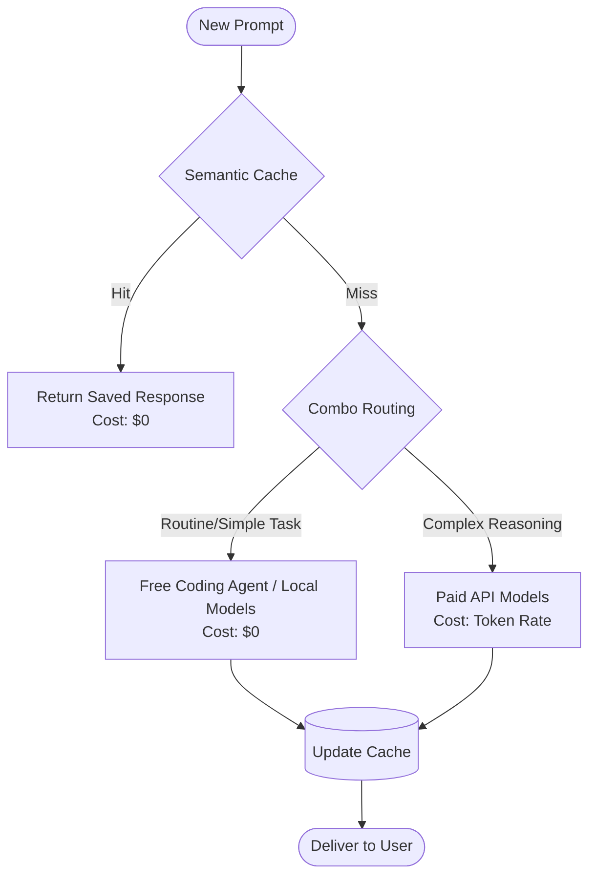

# OmniCode Documentation


## Overview

OmniCode is an advanced, AI-native Integrated Development Environment (IDE). It seamlessly embeds powerful AI model management, intelligent routing, and comprehensive operational visibility directly into the editor's native interfaces.

By integrating the **OmniProxy** control center into the workbench, OmniCode eliminates the need for external browser dashboards and disparate AI tools, providing a unified, highly efficient workspace for developers.

## Product Capabilities

- **Centralized Management:** Manage all AI models, providers, and endpoints natively within the editor.
- **Multi-Provider Support:** Connect to and utilize multiple AI provider accounts simultaneously.
- **Custom Endpoints:** Integrate OpenAI-compatible custom endpoints as first-class model sources.
- **Deep Visibility:** Monitor token consumption, financial costs, usage quotas, and cache performance from a single dashboard.
- **Security-First Architecture:** Ensure user credentials and API keys remain secure locally and are never exposed in source control.

## System Flow & Architecture

OmniCode operates by bridging the native UI components with an embedded, secure runtime that handles all AI communication.

### Request Flow
1. **User Interaction:** A user submits a prompt via the Chat interface or an AI agent.
2. **Model Selection:** The editor retrieves available models from `chatLanguageModels.json`, which is continuously synced by the OmniProxy extension.
3. **Routing:** The request is passed to the **OmniRoute Extension Bridge**, which evaluates any active routing rules, combos, or fallbacks.
4. **Execution:** The **Embedded Runtime** securely authenticates the request using credentials from the local `.env` or VS Code Secret Storage, and dispatches it to the appropriate external AI Provider or Custom Endpoint.
5. **Response:** The LLM's response is streamed back through the proxy to the editor.

### Architecture Diagram


### Cost Optimization & Free Agent Routing

OmniCode significantly reduces developer overhead and API costs by intelligently routing and caching requests:



1. **Semantic Caching:** Identical and highly similar queries are answered from the local cache instantly, saving 100% of the token cost.
2. **Free Coding Agent:** For standard generation and completion, OmniProxy defaults to your configured free-tier accounts or local inference endpoints. This allows developers to use an advanced coding agent without incurring constant per-token charges.
3. **Smart Premium Escalation:** Paid models are only invoked when the complexity of the task demands premium reasoning capabilities, ensuring your budget is spent optimally.

## Core Features

### 1. OmniProxy Native Control Center

The OmniProxy dashboard is a native workbench editor that provides comprehensive control over your AI environment. It uses standard theme tokens and native UI elements to provide a seamless experience.

Sections include:
- **Home:** System health and global model sync status.
- **Providers:** Connection management for 19+ supported AI providers.
- **Combos:** Configuration for multi-model workflows and automated fallbacks.
- **Batch Testing:** Tools for evaluating prompt efficacy across different models.
- **Costs & Analytics:** Granular tracking of request patterns, latency, and financial expenditure.
- **Cache & Limits:** Management of semantic caching, rate limits, and budget quotas.
- **Media:** Controls for image generation and rich media handling.

### 2. Embedded OmniProxy Runtime

The core routing and processing engine resides in the `omniproxy-runtime/` directory. This embedded runtime ensures that OmniCode can operate entirely self-contained without relying on external local servers.

- Securely manages connections to external APIs.
- Applies PII sanitization and caching rules.
- Reads credentials exclusively from secure local storage or ignored `.env` files.

### 3. Unified Model Picker

Models discovered and authenticated via OmniProxy are automatically synchronized with the editor's standard language model system. This means users access all their connected models (whether from Anthropic, OpenAI, or a custom local server) through the native dropdowns and chat interfaces they already know.

### 4. Custom Endpoints Integration

Adding a custom OpenAI-compatible endpoint is streamlined:
1. Provide a group name.
2. Supply the API key.
3. Enter the Base URL.

OmniCode automatically queries the `/models` endpoint and populates the available models into the unified picker.

### 5. Personalized Coding Agent

OmniCode empowers you to build a highly tailored coding assistant. Through the **Combos** configuration in OmniProxy, you can define custom system prompts, specialized context boundaries, and preferred model fallbacks. This creates a personalized coding agent that aligns perfectly with your specific project guidelines and personal coding style, no matter which backend AI provider is currently active.

## Source Map

Key implementation areas within the repository:

- `product.json`
  Product identifiers, naming, and application metadata.
- `resources/`
  Application icon assets for macOS, Windows, Linux, and web.
- `src/vs/workbench/contrib/chat/browser/omniProxyManagement/`
  The source code for the native OmniProxy management dashboard.
- `omniproxy-runtime/`
  The embedded OmniProxy Node.js backend.
- `src/vs/workbench/contrib/chat/common/languageModels.ts`
  Core logic for model discovery and custom endpoint integration.
- `extensions/omniroute/`
  The extension bridge connecting the workbench UI to the OmniProxy runtime.

## Build and Run Instructions

### 1. Install Dependencies
```bash
npm install
```

### 2. Compile the Application
```bash
npm run gulp compile
```

### 3. Bundle Desktop Assets
```bash
node build/next/index.ts bundle --out out --target desktop
```

### 4. Launch OmniCode
```bash
# macOS
open -na '.build/electron/OmniCode.app' --args '.'
```

## Security and Credential Handling

OmniCode is designed to ensure maximum security for user credentials:

- **No Secrets in Source:** API keys, OAuth tokens, and secrets are strictly excluded from source control.
- **Secure Storage:** All sensitive endpoint keys must be stored in the editor's encrypted secret storage.
- **Local Environments:** Development and runtime secrets are loaded from a `.env` file that is ignored by Git.
- **Artifact Protection:** Generated logs, databases, and UI-capture artifacts are excluded from the repository to prevent accidental data leaks.
