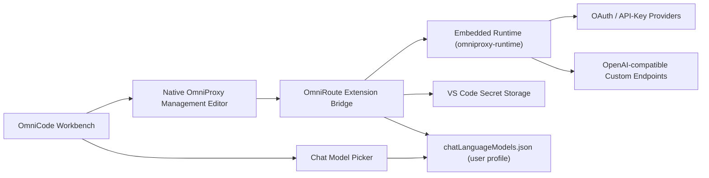
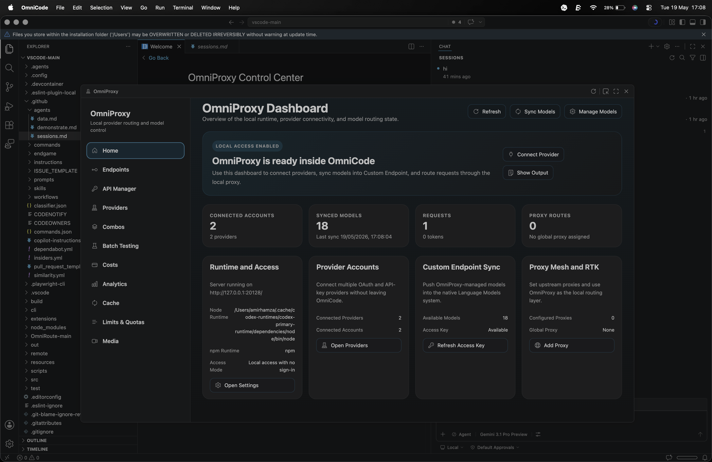
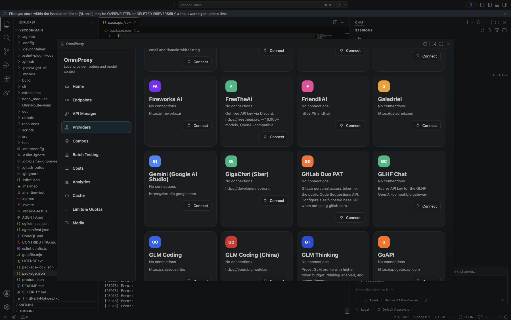

# OmniCode Documentation


## What OmniCode is

OmniCode is a custom VS Code fork centered around two changes:

1. OmniCode branding replaces the default OmniCode identity.
2. OmniProxy becomes a native part of the editor for provider management, model sync, routing, and operational visibility.

The project keeps the core VS Code workbench and extension model, then layers OmniProxy capabilities into native editor surfaces instead of separate browser-hosted control panels.

## Product goals

- Keep model and provider management inside the editor
- Support multiple connected provider accounts at once
- Make custom endpoints a first-class model source
- Surface token, cost, quota, and cache visibility in one place
- Avoid committing user credentials into source control

## Architecture



## Main feature areas

### 1. OmniProxy native control center

The OmniProxy titlebar action opens a native workbench editor with a left navigation rail and card-based content areas.

Available sections:

- `Home`
- `Providers`
- `Combos`
- `Batch Testing`
- `Costs`
- `Analytics`
- `Cache`
- `Limits & Quotas`
- `Media`

Each section is rendered from native workbench code in:

- `src/vs/workbench/contrib/chat/browser/omniProxyManagement/`

The runtime and provider data is supplied by:

- `extensions/omniroute/src/extension.ts`

The UI styling intentionally tracks VS Code rather than a custom branded dashboard skin:

- standard VS Code theme tokens
- neutral monochrome provider icons
- flatter panels and smaller cards
- minimal gradients and no decorative background branding

### 1.1 Embedded OmniProxy runtime

OmniProxy now resolves its runtime from:

- `omniproxy-runtime/`

This removes the prior dependency on a separate `OmniRoute-main` folder name or workspace layout. The extension still has a legacy fallback for older local setups, but the checked-in runtime source now lives under the main repository.

The embedded runtime path is designed for repo safety:

- source files are committed
- `node_modules/`, `.next/`, `logs/`, and generated `.env` files are ignored
- tracked sources do not include live OAuth client IDs or client secrets
- the extension reuses the existing `STORAGE_ENCRYPTION_KEY` from legacy OmniRoute env files when migrating encrypted local state

Provider OAuth credentials for local or deployed use should be supplied through a local ignored `.env` file, deployment secrets, or `data/provider-credentials.json` where supported.

### 2. Provider connections

OmniProxy supports multiple provider accounts and exposes them through the native `Providers` section. The integration is designed so connected providers can be:

- inspected
- tested
- used for model sync
- routed through combos and proxy rules

### 3. Custom endpoints

OmniCode extends the language model flow so a custom endpoint can be added with the minimum required inputs:

- group name
- API key secret reference
- base URL

After that, OmniCode fetches `/models` from the endpoint and allows the user to choose from the returned models. If model discovery fails, the flow can fall back to manual model entry.

### 4. Synced models in the standard model picker

Models discovered through OmniProxy are written into the same language model system used by chat and agents. That means OmniProxy-managed models do not live in a separate picker or a special-case UI. They show up where users already expect to select a model.

### 5. Branding

OmniCode replaces the old OmniCode visual identity with the new OmniCode mark across:

- app bundle icon assets
- workbench logo surfaces
- session and welcome assets
- server/favicon assets

## Screenshots

### OmniProxy dashboard



### Limits and quotas section



## Source map

Important implementation areas:

- `product.json`
  Product naming, application identifiers, and top-level branding
- `resources/`
  App icon assets for macOS, Windows, Linux, and server/favicon outputs
- `src/vs/workbench/browser/media/code-icon.svg`
  Shared workbench logo surface
- `src/vs/workbench/contrib/chat/browser/omniProxyManagement/`
  Native OmniProxy management editor
- `omniproxy-runtime/`
  Embedded OmniProxy runtime source shipped inside the main repository
- `src/vs/workbench/contrib/chat/common/languageModels.ts`
  Custom endpoint creation flow and model discovery
- `extensions/omniroute/`
  OmniProxy runtime bridge, commands, sync logic, and configuration

## Build and run

### Install dependencies

```bash
npm install
```

### Compile

```bash
npm run gulp compile
```

### Bundle desktop assets

```bash
node build/next/index.ts bundle --out out --target desktop
```

### Launch the app

```bash
open -na '.build/electron/OmniCode.app' --args '.'
```

## Credential handling

This repository should stay free of user secrets.

Rules followed in this tree:

- API keys are not committed to source control
- endpoint secrets should be stored in VS Code secret storage
- generated local UI-capture artifacts are removed or ignored
- user model state belongs in the local profile, not the repository

Recommended practice for contributors:

1. Keep custom endpoint keys in secret storage only.
2. Do not commit local profile files such as `chatLanguageModels.json`.
3. Do not commit generated `omniproxy-runtime/.env`, `node_modules`, `.next`, or log directories.
4. Keep generated automation logs and screenshots out of git unless they are intentionally curated documentation assets.

## Current scope

This fork focuses on:

- native OmniProxy management
- custom model integration
- multi-provider workflows
- OmniCode branding

It does not attempt to preserve the stock OmniCode branding or the default product messaging.
